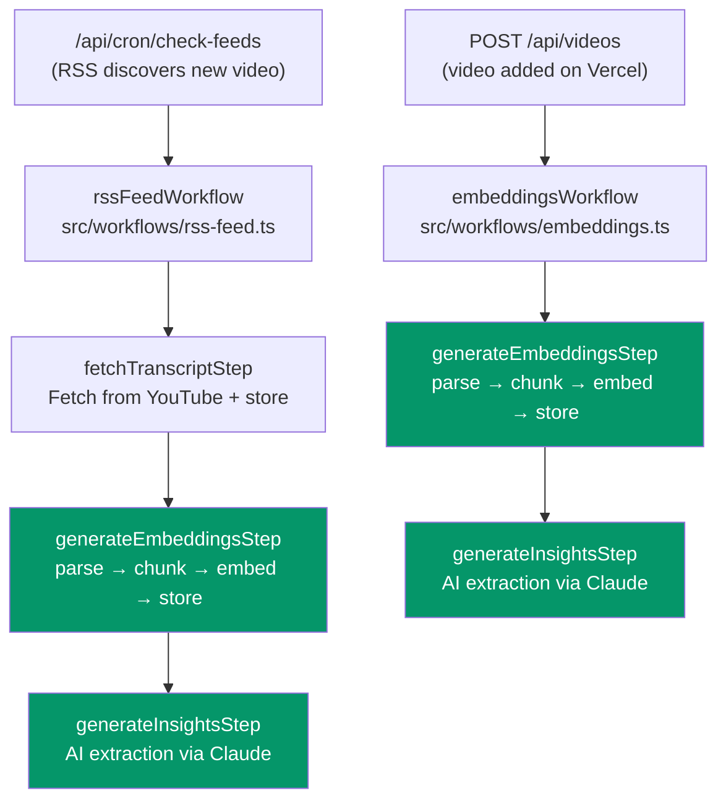

# Vercel Workflows

How Sluice uses Vercel Workflows (WDK) for durable, fault-tolerant async processing in production. Covers the two existing workflows, shared steps, dispatch patterns, and how local development differs.

---

## Why Workflows

Sluice's embedding pipeline and AI insight generation can take 30+ seconds per video -- well beyond Vercel's serverless function limits. Rather than hoping requests finish in time, Sluice uses [Vercel Workflows](https://vercel.com/docs/workflow-kit) to make these operations durable. Each workflow breaks into independently retryable steps: if a step fails (network blip, cold start timeout, API rate limit), WDK retries it automatically (3 attempts with exponential backoff) without re-running earlier steps that already succeeded.

> **Beta:** Sluice uses `workflow@^4.2.0-beta.70`. The WDK API may change in future releases. The current version is pinned in [`package.json`](../package.json).

---

## How It Works

Vercel's Workflow Development Kit (WDK) introduces two TypeScript directives and two integration points:

| Primitive | Import / Usage | Purpose |
|-----------|---------------|---------|
| `'use workflow'` | Directive (first line of function body) | Marks an `async` function as a durable workflow |
| `'use step'` | Directive (first line of function body) | Marks an `async` function as an independently retryable step |
| `withWorkflow()` | `import { withWorkflow } from 'workflow/next'` | Wraps `next.config.ts` to enable WDK compilation |
| `start()` | `import { start } from 'workflow/api'` | Dispatches a workflow (fire-and-forget) |

Source: [`next.config.ts`](../next.config.ts) line 2 (`withWorkflow` import) and line 55 (`export default withWorkflow(nextConfig)`).

Here's what a workflow looks like in practice (from [`src/workflows/embeddings.ts`](../src/workflows/embeddings.ts)):

```typescript
export async function embeddingsWorkflow(videoId: number): Promise<void> {
  'use workflow'
  await generateEmbeddingsStep(videoId)
  await generateInsightsStep(videoId)
}
```

The `'use workflow'` directive tells WDK to transform this function at build time. Each `await`ed step with a `'use step'` directive becomes a checkpoint -- if the function crashes between steps, WDK resumes from the last completed step rather than starting over.

---

## The Two Workflows

Sluice has two workflows that handle the full pipeline from video ingestion to searchable knowledge:



Green steps are shared between both workflows (defined in [`src/workflows/steps.ts`](../src/workflows/steps.ts)).

### Embeddings Workflow

Source: [`src/workflows/embeddings.ts`](../src/workflows/embeddings.ts)

Triggered when a video is added via `POST /api/videos` on Vercel. Two sequential steps:

1. **`generateEmbeddingsStep(videoId)`** -- Parse the transcript, chunk it (~2000 chars with 100-char overlap), embed each chunk via all-MiniLM-L6-v2, store 384-dim vectors in pgvector
2. **`generateInsightsStep(videoId)`** -- Send the transcript to Claude (Sonnet 4) for structured extraction: summary, key insights, action items, knowledge prompts, plugin suggestions

If step 1 fails after 3 retry attempts, step 2 never runs. The video still exists in the database -- it just won't be searchable or have insights until the workflow succeeds.

Dispatch point: [`src/app/api/videos/route.ts`](../src/app/api/videos/route.ts) line 244.

### RSS Feed Workflow

Source: [`src/workflows/rss-feed.ts`](../src/workflows/rss-feed.ts)

Triggered by the `check-feeds` cron job when RSS delta detection discovers a new video from a followed channel. Three sequential steps:

1. **`fetchTranscriptStep(videoId, youtubeId)`** -- Fetch the transcript from YouTube and store it on the video record
2. **`generateEmbeddingsStep(videoId)`** -- Same as embeddings workflow step 1
3. **`generateInsightsStep(videoId)`** -- Same as embeddings workflow step 2

The `fetchTranscriptStep` is defined locally in `rss-feed.ts` (not shared) because it needs the `youtubeId` parameter that only the RSS path provides. Steps 2 and 3 are the same shared functions from [`steps.ts`](../src/workflows/steps.ts).

Dispatch point: [`src/app/api/cron/check-feeds/route.ts`](../src/app/api/cron/check-feeds/route.ts) line 29.

---

## Shared Steps

Source: [`src/workflows/steps.ts`](../src/workflows/steps.ts)

Both workflows share step functions that wrap the existing processor logic in [`src/lib/automation/processor.ts`](../src/lib/automation/processor.ts). The steps are thin wrappers -- one line of business logic plus the `'use step'` directive:

| Step | Wraps | What It Does | Idempotent? |
|------|-------|-------------|-------------|
| `generateEmbeddingsStep(videoId)` | `processGenerateEmbeddings()` | Parse transcript, chunk, embed, store vectors | Yes |
| `generateInsightsStep(videoId)` | `processGenerateInsights()` | AI extraction via Claude API | Yes |
| `fetchTranscriptStep(videoId, youtubeId)` | `fetchAndStoreTranscript()` | Fetch YouTube transcript, store on video record | Yes (overwrites) |

The processor functions are the single source of truth for what each pipeline stage does. Workflow steps add durability (retry, checkpointing) without duplicating business logic. WDK provides 3 retry attempts per step on unhandled errors.

---

## Dispatch

Both dispatch points follow the same fire-and-forget pattern: call `start()`, log failures, never fail the HTTP response.

From [`src/app/api/videos/route.ts`](../src/app/api/videos/route.ts) lines 240-266:

```typescript
// Auto-embed: local = inline after(), Vercel = durable workflow
if (createdVideo && transcript && transcript.trim().length > 0) {
  if (process.env.VERCEL) {
    try {
      await start(embeddingsWorkflow, [createdVideo.id])
    } catch (error) {
      console.error(`[workflow-dispatch] Failed to start embeddings workflow...`, error)
    }
  } else {
    after(async () => {
      // Local fallback: parse → chunk → embed (no insights)
    })
  }
}
```

`start()` returns a run ID but the codebase doesn't use it -- dispatch is fire-and-forget. If workflow dispatch fails (e.g., transient Vercel API error), the video is still created successfully. The user sees their video; embeddings and insights arrive asynchronously when the workflow completes.

The cron dispatch in [`check-feeds/route.ts`](../src/app/api/cron/check-feeds/route.ts) follows the same pattern: create the video record first, then dispatch `rssFeedWorkflow`. Failures are logged but don't block the cron response.

### Local Development

Workflows require Vercel's infrastructure -- they don't run locally. The codebase uses `process.env.VERCEL` (set automatically by Vercel) to branch between two execution paths:

| Environment | Video Add Path | RSS Cron Path |
|-------------|---------------|---------------|
| **Vercel** | `start(embeddingsWorkflow)` -- embeddings + insights | `start(rssFeedWorkflow)` -- transcript + embeddings + insights |
| **Local** | `after()` callback -- embeddings only | Not typically run locally |

> **Note:** The local `after()` fallback generates embeddings but does **not** generate insights. To get insights locally, use the video detail page (`/videos/[id]` > Insights tab > Generate). The Vercel workflow path handles both automatically.

---

## Relationship to Job Queue

Sluice originally used a database-backed job queue (the `jobs` table with `fetch_transcript`, `generate_embeddings`, and `generate_insights` job types) processed by a `process-jobs` cron. Workflows replaced this chain in production:

| Aspect | Old (Job Queue) | Current (Workflows) |
|--------|-----------------|---------------------|
| **Retry** | 3 attempts via job processor loop | 3 attempts per step via WDK |
| **Durability** | Jobs table + polling cron | Vercel-managed durable execution |
| **Orchestration** | Job chaining (one job creates the next) | Sequential steps in a single workflow |
| **Cron dependency** | Required `process-jobs` every 5 minutes | No processing cron needed |

The `process-jobs` cron endpoint and its route directory have been removed. The `check-feeds` cron in [`vercel.json`](../vercel.json) now dispatches workflows directly instead of queuing jobs.

The processor functions in [`src/lib/automation/processor.ts`](../src/lib/automation/processor.ts) are shared -- workflow steps call the same `processGenerateEmbeddings()` and `processGenerateInsights()` that the old job processor used. The `jobs` table still exists in the schema but is no longer the primary pipeline mechanism in production.

---

## Testing

Source: [`src/workflows/__tests__/`](../src/workflows/__tests__/)

Workflow tests mock the step functions and verify execution order:

- **[`embeddings.test.ts`](../src/workflows/__tests__/embeddings.test.ts)** -- Verifies 2-step sequential execution, step 1 failure blocks step 2, error propagation
- **[`rss-feed.test.ts`](../src/workflows/__tests__/rss-feed.test.ts)** -- Verifies 3-step sequential execution, failure isolation at each stage, error propagation

Dispatch point tests (in [`src/app/api/videos/__tests__/route.test.ts`](../src/app/api/videos/__tests__/route.test.ts) and [`src/app/api/cron/check-feeds/__tests__/route.test.ts`](../src/app/api/cron/check-feeds/__tests__/route.test.ts)) mock `workflow/api`'s `start()` function and verify:

- Correct workflow function and arguments passed to `start()`
- Dispatch failures don't fail the HTTP response
- Videos are created regardless of workflow dispatch outcome

The testing pattern uses `vi.mock()` on the steps module with a `callOrder` array to assert sequential execution:

```typescript
vi.mocked(generateEmbeddingsStep).mockImplementation(async () => { callOrder.push('embeddings') })
vi.mocked(generateInsightsStep).mockImplementation(async () => { callOrder.push('insights') })

await embeddingsWorkflow(42)

expect(callOrder).toEqual(['embeddings', 'insights'])
```

---

## Further Reading

- **[Core Concepts](core-concepts.md)** -- Pipeline architecture, automation, and how workflows fit into the broader system
- **[Getting Started](getting-started.md)** -- Local setup (where `after()` runs instead of workflows)
- **[DEPLOY.md](../DEPLOY.md)** -- Production deployment where workflows run on Vercel
